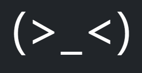

<a id="readme-top"></a>


<!-- PROJECT LOGO -->
<br />
<div align="center">
  <a href= "https://github.com/CodecoolGlobal/freestyle-mern-project-react-pannaincze"
    
  </a>

<h3 align="center">A MERN Project</h3>

  <p align="center">
    A learning project for MERN stack
  </p>
</div>

### Contributors

* [Lichtner Levente][https://github.com/LichtnerLevente]
* [Király Bence][https://github.com/breezh]
* [Incze Panna][https://github.com/pannaincze]

<p align="right">(<a href="#readme-top">back to top</a>)</p>

<!-- TABLE OF CONTENTS -->
<details>
  <summary>Table of Contents</summary>
  <ol>
    <li>
      <a href="#about-the-project">About The Project</a>
      <ul>
        <li><a href="#built-with">Built With</a></li>
      </ul>
    </li>
    <li>
      <a href="#getting-started">Getting Started</a>
      <ul>
        <li><a href="#prerequisites">Prerequisites</a></li>
        <li><a href="#installation">Installation</a></li>
      </ul>
    </li>
    <li><a href="#usage">Usage</a></li>
    <li><a href="#roadmap">Roadmap</a></li>
    <li><a href="#contributing">Contributing</a></li>
    <li><a href="#contact">Contact</a></li>
  </ol>
</details>


<!-- ABOUT THE PROJECT -->
## About The Project

[![Product Name Screen Shot][product-screenshot]]
This collaborative project, developed by a team of three, focuses on designing a dynamic website using the MERN (MongoDB, Express.js, React, Node.js) stack. The primary objective of the web application is to provide users with a list of random activities to do when boredom strikes. Leveraging the MERN stack, each team member contributed their expertise in frontend and backend programming to create a cohesive and engaging web experience.

<p align="right">(<a href="#readme-top">back to top</a>)</p>


### Built With

* [](https://en.wikipedia.org/wiki/JavaScript)
* []
(https://www.mongodb.com/Mongo-url)
* []
(https://expressjs.com/Express-url)
* [B]
(https://react.dev/)
* [![Node][Node.js](https://img.shields.io/badge/Node-20232A?style=for-the-badge&logo=node&logoColor=black)]
(https://nodejs.org/en)
* []
(https://getbootstrap.com/)
* [![Docker][Docker.com](https://img.shields.io/badge/Docker-563D7C?style=for-the-badge&logo=docker&logoColor=blue)]
(https://www.docker.com/)


<p align="right">(<a href="#readme-top">back to top</a>)</p>0


<!-- GETTING STARTED -->
## Getting Started

### Prerequisites

To begin it is advised to have the following softwares:
* <a href="https://www.docker.com/products/docker-desktop/">Docker Desktop</a>,
* <a href="https://www.oracle.com/java/technologies/javase/jdk17-archive-downloads.html">Node</a>

### Installation

1. **Download Docker:**
   - Download and install Docker from [Docker's official website](https://www.docker.com/get-started).

2. **Clone the Repository:**
   ```bash
   git clone https://github.com/CodecoolGlobal/freestyle-mern-project-react-pannaincze/edit/development/README.md
   ```

3. **Navigate to the Project Directory:**
   ```bash
   cd [project_directory]
   ```

4. **Run Docker Compose:**
   ```bash
   docker-compose up
   ```

   This command will pull the necessary images, build the containers, and launch the application.

5. **Access the Application:**
   - You can open your browser and go to [http://localhost:3000](http://localhost:5000) to see the site for yourself.


<p align="right">(<a href="#readme-top">back to top</a>)</p>


<!-- MARKDOWN LINKS & IMAGES -->
<!-- https://www.markdownguide.org/basic-syntax/#reference-style-links -->

[project_url]:https://github.com/CodecoolGlobal/freestyle-mern-project-react-pannaincze
[React.js]: https://img.shields.io/badge/React-20232A?style=for-the-badge&logo=react&logoColor=61DAFB
[React-url]: https://reactjs.org/
[Bootstrap.com]: https://img.shields.io/badge/Bootstrap-563D7C?style=for-the-badge&logo=bootstrap&logoColor=white
[Bootstrap-url]: https://getbootstrap.com
